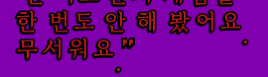
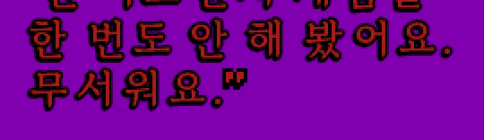
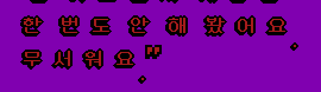
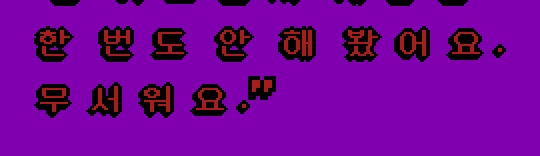

# Hi-res text in the SCUMM engine

The engine's side of the hi-res text layer. Everything that knows about SCUMM
lives here; the font handling itself is in `graphics/hires_text` and has no
engine dependency, so a second engine can reuse it without inheriting SCUMM's
screen model.

## What it does

A CJK translation ships bitmap fonts drawn on the game's 320x200 grid. This
layer lets it ship larger ones instead: the text surface is enlarged by an
integer factor (1-3), the translation's fonts are replaced by anti-aliased
`.fnt` files baked at that size, and the result is composited over the
unscaled game. Game graphics are untouched; only text is drawn differently.

`ScummHiResText` owns the configuration, the loaded fonts and the drawing
entry points that `CharsetRenderer` calls into. When it is not enabled the
engine never reaches this code, which is the guarantee that every game we do
not touch stays untouched.

## Configuration

`HIRES_TEXT_SETUP.md` is the setup reference for people configuring a game:
every ini key and map section with examples, how to bake the fonts, and what
the diagnostics mean. What follows here is the same ground from the engine's
side, kept because the rest of this document refers to it.

Per target, in `scummvm.ini`:

| key | values | default | meaning |
|---|---|---|---|
| `hires_text_map` | path | *(none)* | map file; relative paths resolve against the game folder |
| `hires_text_scale` | 1-3 | from map, else 1 | text surface multiplier; outranks the map |
| `hires_text_alpha` | bool | from map, else false | keep a coverage surface and blend, instead of stencilling |
| `hires_text_metrics` | `game` / `font` | `game` | whose advances lay the line out (see below) |
| `hires_text_log` | bool | false | print one `HRTEXT` line per string drawn, with charset and font |

Codes a game repurposed for pictograms are named in the map's `[glyphs]`
section rather than by an ini key; see below.

The older `korean_hires_scale` and `korean_alpha_text` keys are still read,
so an existing install keeps working. The new names win when both are present.

`korean_ttf_map` and the `korean_ttf.map` file name are **not** read. Those
maps are in the TrueType-era format; honouring them let the legacy loader draw
the text while this layer supplied only the scale, and the mismatch showed up
as click drift in Loom. A configured `korean_ttf_map` produces a warning.

None of these keys can be passed on the command line; ScummVM rejects unknown
options there. They go in the target's section.

### Where the map comes from

1. `hires_text_map` in the target section, if set. A missing file is a warning
   and the layer stays off.
2. Otherwise `hires_text.map` in the game folder, if one is there. This is how
   a translation ships hi-res text and needs no setup.
3. Otherwise the layer is off.

Map sections may be narrowed by game id or by SCUMM version, most specific
first - `[fonts:monkey2]`, then `[fonts:v5]`, then `[fonts]`. Those strings are
the engine's business; the parser treats them as opaque qualifiers.

### There is no "off" switch yet

`enabled()` is true whenever a map loaded *and* it asks for something - a
scale above 1, or a replacement bitmap font. With a `hires_text.map` in the
game folder there is currently no ini key that turns the layer off short of
removing the file: `hires_text_scale=1` only drops the scale, the replacement
fonts still apply. A `hires_text=false` master switch is the planned fix and
the natural thing to bind a GUI checkbox to.

## Ordering

`loadConfig()` runs before `loadCJKFont()`, because a map may name the scale the
rest of the setup works from. A user setting outranks the map, so logical font
sizes (`12pt`) are only resolved afterwards, by `resolvedFontSize()`.

`loadFonts()` runs after the charsets are known. The map names a numbered set
(`multi=hr%02d.fnt`, one file per charset the game uses) or a single file
(`single=`) standing in for all of them; a charset without a file of its own
falls back to the nearest loaded one. Latin companions (`[latin] bitmap=`) are
loaded the same way, because a double-byte set carries no ASCII and a Latin
face at the wrong cell sits on a different baseline from the Hangul beside it.

The default source encoding follows the detected language (CP949 for Korean,
CP932 for Japanese, CP936/CP950 for Chinese) and is otherwise left unset - a
single byte game defines its own, and the adapter must be told explicitly
before assuming anything else.

## Glyphs a game drew itself

A game's own font is not a character set. LucasArts titles store an ellipsis
where Latin-1 has `^`, solid arrows where it has `_` and DEL, and Monkey
Island 2 puts a skull-and-crossbones dialogue bullet at `0x07`, which no Latin
face has anything for at all. Left alone, the layer routes every single byte
code to the replacement font and reports it as drawn - so the picture is not
merely wrong, the fallback that would have drawn the original never runs and
the character disappears.

`[glyphs]` names the exceptions:

```ini
[glyphs]
0x5e = keep        ; an ellipsis, not a caret
0x07 = keep        ; the dialogue bullet
0x7f = u+2192      ; drawn from the replacement at another code point

[glyphs:cs1]       ; charset 1 only
0x5f = keep
```

Every `; ...` above parses as written: a `;` with whitespace before it ends
the value, so it is a comment rather than part of it (`HIRES_TEXT_SETUP.md`,
"The map file", has the exact rule, plus the range syntax `[glyphs]` also
takes).

`keep` declines before a font is chosen, which is what lets the existing
fallback draw the game's own glyph; `advanceFor()` declines in step, so the
line still measures as the game laid it out. A `u+XXXX` value draws that code
point from the replacement instead.

Scopes matter because the repurposed slots differ per charset: `0x5F` is a
left arrow in a dialogue font and a genuine underscore in the others. The
adapter names each charset `cs0`, `cs1`, ... and a scoped entry overrides the
common table for that charset only.

Offline baking honours the same table: the set is filtered per charset before
baking, dropping `keep` codes and adding remap targets. The run-time TrueType
path bakes nothing: it opens the face once per pixel size (the charset's game
cell times the scale) and rasterises each code point the first time it is
drawn, so a `keep` code is never asked for and a remap target is rasterised
like any other character.

Keys are parsed as `0x5e`, `94` or `u+2192`, but note that `Common::INIFile`
only allows alphanumerics, `-`, `_`, `.`, `:` and space in a **key**, and
rejects the whole map on anything else. So `u+2192` is fine as a value while a
key must be written `0x7f`.

## Decorations: outline and shadow

A map can ask for an outline or a drop shadow around every glyph:

```ini
[shadow]
mode=outline     ; none | drop | outline | stroke | game
offset=2         ; thickness in output pixels
color=8          ; palette index of the stroke
```

These `; ...` comments parse as written, by the same whitespace-before-`;`
rule as the `[glyphs]` example above.

The decoration is built as a dilation mask and laid down solid before the
body, the way `FontSJISBase::drawChar` does it in `graphics/sjis.cpp` -
drawing the glyph again at offsets would give the stroke the body's own
antialiasing, and it would then blend into the background it exists to hide.

Two traps are worth knowing before writing a map:

- **`color=0` is not portable.** FM-Towns clears its text plane to 0 and
  reads 0 back as transparent, so a stroke in colour 0 vanishes there. It
  also skips any decoration drawn in the text colour, which is 4 on that
  platform. Use 8.
- **`offset` has to suit the replacement font's weight**, not the dark-pixel
  count. At `offset=3` a thin face's outline closes the gaps between letters
  even though the totals match the original.

See `HIRES_TEXT_DECORATIONS.md` for the measurements behind both, why a
baked-in stroke cannot work, and what the TTF path can carry.

## Metrics: whose advances to use

These are `scummvm.ini` keys, read by `ConfigManager`, which has no inline
comments — the two lines below are shown separately, not as one file, for
that reason:

```
# the game's own advances
hires_text_metrics=game
```
```
# the replacement font's advances
hires_text_metrics=font
```

The game decides line breaks and speech-bubble sizes from the widths of its
own font, so a replacement that advances differently can wrap text in the wrong
place or push it out of a bubble. For bitmap (SVFN) replacements the default
therefore keeps the original spacing and merely draws a better glyph in the
same box. A **TrueType** face with no metrics key set anywhere steps by its own
advances instead: wide glyphs since C31, Latin since C34/C36 (see below).
`hires_text_metrics=game` (or `[render]`/`[font.N]`/`[latin] metrics=game` in
the map) brings the game's spacing back.

`metrics=font` is for a proportional replacement that should space itself.
Only fonts with a metrics table (SVFN header flags bit 0) are affected;
a fixed-width replacement advances by its cell whatever this says.

Measured on Indy3's proportional `vj00.fnt` at scale 2:

| character | font advance | scaled to game px | game said |
|---|---|---|---|
| U+D0B9 | 18 | 9 | 4 |
| U+E2B1 | 20 | 10 | 4 |
| U+E7B4 | 21 | 11 | 4 |
| U+B8BA | 19 | 10 | 4 |

Note the game advanced every character by 4 regardless; the replacement varies
per glyph, which is the point. With `metrics=game` the code is not consulted at
all - the probe recorded zero calls - so existing layouts cannot shift.

## Per-charset faces and per-glyph placement

A map may name faces and sizes per charset, and the Latin modes, with the
same keys and meanings as SCI (`docs/i18n/HIRES_TEXT_MAP.md`); the number in
`[font.N]` is the SCUMM **charset id**, 0..19:

```ini
[hires]
scale=2
alpha=true
face=ko, th
size=24

[fonts]
ko=/System/Library/Fonts/AppleSDGothicNeo.ttc
th=sukhumvit-text.ttf

[font.2]
size=20

[font.4]
bitmap=subtitle24.fnt

[latin]
mode=proportional
metrics=font
```

- **Faces.** `[font.N] face=`, else `[hires] face=`, else `[fonts] default=`;
  the ini `hires_text_font` still overrides all of them. `face=` may be a
  comma-separated chain: each code point is drawn by the first face that has
  it (`FallbackGlyphSource`), then by the game's own font.
  `[font.N] bitmap=` names an SVFN for that charset, tried before its faces.
- **Sizes.** `[font.N] size=`, else `[hires] size=`: the characters are that
  many pixels tall (SCI's meaning). With no size, a face is opened at the
  game cell times the scale with its line filling the cell, as before.
  `[hires] size=` applies to every charset, so a game whose charsets have
  different cell heights (MI1's 16-px sentence line beside its 24-px
  dialogue) should name `[font.N] size=` per charset instead.
- **Latin** (`[font.N] latin=`, else `[latin] mode=`): `off` leaves ASCII to
  the game's font; `half` draws it from the face at the face's narrow cell;
  `fullwidth` draws U+FF01..U+FF5E (and U+3000 for a space with
  `space=fullwidth`); `proportional` draws it from the face and advances by
  `[latin] metrics=` (`game`: the game's width; `font`: the face's advance,
  `latinAdvanceGamePx()`). SCUMM's default is `proportional`, which is what
  it always did with ASCII; `[latin] enabled=false` turns it off.
- **Latin baseline** (`[latin] baseline=game|face`, default `game`): with
  `face`, ASCII drawn by a bitmap (SVFN) face is placed by the baseline baked
  into that face and the game glyph's own `offsX`/`offsY` no longer apply.
  For charsets whose Latin glyphs are cut to their ink (MI2's title and
  credit cards). See "Baselines and glyph offsets" below.
- **Advances** (`advanceFor()`), per glyph, from `UnicodeGlyphSource::metrics()`:
  a **wide** glyph (Hangul, kanji) keeps the cell rule below, so the game's
  grid and a legacy layout do not move; a **combining** mark advances 0; any
  other glyph advances by the face (`metrics=font` unless `[font.N] metrics=`
  or the ini says `game`). The ini `hires_text_metrics` wins everywhere, then
  `[font.N] metrics=`; ASCII then takes `[latin] metrics=` and wide glyphs
  `[render] metrics=`.
- **Drawing** (`drawChar()`): a glyph under `metrics=game` narrower than the
  cell it steps by is centred in it. A combining mark is drawn at the pen
  after the previous base minus its `originX`, the pen being kept in overlay
  pixels, and moves nothing. A Latin SVFN beside a TrueType face sits on the
  face's baseline (`TtfGlyphSource::baseline()`), as it did on the baked
  font's ascent.
- **Coverage.** With a translation loaded (`korean.trs` and the like), its
  strings are decoded once and 64 of their code points are sampled; each face
  of a chain is checked against what the faces before it lack, with one
  warning per face (`hires text: <face> lacks N of 64 sampled characters
  ...`). A face sized by the map also fits that sample into its cell.

None of this applies to a map without these keys: `[hires] face/size`,
`[font.N]`, `[latin] mode/space` (or UTF-8 text) switch it on
(`perGlyphMetrics()`); an older map keeps every advance and every pixel.

### Wide glyphs from a face step by the face (C31)

With no metrics= key at all (not the ini `hires_text_metrics`, not
`[font.N] metrics=`, not `[render] metrics=`), a wide glyph drawn by a
TrueType face - a CP949 double-byte character or a wide code point of a
UTF-8 translation - steps by the face's own advance (widened to its ink),
rounded up to game pixels, and is drawn at the pen. An explicit
`metrics=game` keeps the game's cell (a Korean patch's `korean0N.fnt` cell
plus the 1-px gap); bitmap (SVFN) faces keep it too. Wrapping and centring
measure a double-byte character with the same step, and the right-edge clip
uses it.

A UTF-8 translation beside a CJK patch's fonts (`korean%02d.fnt`,
`korean.fnt`, `chinese_gb16x12.fnt`) with hi-res text on reads only those
files' headers and gives each code point the layer draws the patch's cell,
offsets, shadow and line height, so it draws as the CP949 bundle does.
Centred UTF-8 text breaks Hangul at spaces, as the Korean patches do, but
only with the layer on; with hi-res text off UTF-8 text breaks as before.

Known limits:
- **Round-up slack.** The step is rounded up per glyph with no carry, so
  each syllable can be up to (scale - 1) px looser than the face: nothing at
  1x, at most 1 px at 2x, 2-3 px at 3x/4x.
- **FM-Towns SJIS.** `CharsetRendererTownsV3`/`TownsClassic::getCharWidth()`
  return a fixed width for a double-byte character and do not ask
  `advanceFor()`, while drawing now steps by the face: a centred Japanese
  FM-Towns line under a TrueType map without a metrics= key is measured
  wider than it is drawn and sits left of centre by (cell - step) x n / 2.
  Give such a map `[render] metrics=game`.

### Latin from a TrueType face steps by the face (C34, C36)

ASCII letters, digits and punctuation drawn by a TrueType face step by the
face's own advance (rounded half up to game pixels, SCI's proportional rule,
no carry) and are drawn at the pen, whatever the text around them, unless a
metrics= key is set (the ini's `hires_text_metrics`, `[render]`, `[font.N]`
or `[latin] metrics=`). The game's Latin widths belong to its own, larger
bitmap font, and per-glyph placement centred the smaller face letter in
them, so "Thriftweed" read "T h r i f t w e e d" and English "Well, then"
read "W e l l, t h e n". The game's `offsX` for the character no longer
applies, and wrapping, centring, the right-edge clip and an ASCII code the
game's charset lacks (drawn by the layer at the same step) all use the same
step.

C34 did this only inside CJK text (the engine lays it out on a CJK font's
cells, `setGameFontCell()`) and in UTF-8 translations; C36 made it the
default everywhere, the game's own English included. **English line breaks
change** with such a map: lines are narrower, so the game fits more words per
line ("My name's Guybrush Threepwood, and I want to be a pirate!" now fits on
one line in MI1's lookout scene) and centres on the new width.

The space steps by the face too, unless the game lays its text out on CJK
cells (a Korean patch in CP949 or its cells under `ko.trs`): there it is the
word gap between Hangul words and keeps the game's width.

The face also puts the glyph on its own baseline, so the game glyph's own
y offset (MI1 drops `,` `p` `g` `j` one game pixel) no longer applies; the
offset the charset's Latin line shares (that of `x`, else `a`) still does.
Korean text changes only where it has such Latin punctuation (`,` `;` `'`).

ASCII the game's charset lacks is now drawn by the face in English too, at
the step it is measured with (C34 did this inside CJK text): MI1's charset 6,
for one, has no `,` or `.`, which the original measured 0 and never drew.

Unchanged:
- an explicit `metrics=game` in any of the places above: the old spacing,
  byte for byte (English MI1 with `hires_text_metrics=game` is frame-identical
  to the build before C36);
- `[latin] metrics=font`, which keeps its own proportional path (with carry);
- `[latin] mode=off|half|fullwidth`, a `[glyphs]` keep or remap of the code,
  and a mirrored charset kept on the game's font (C27);
- bitmap (SVFN) faces, which keep the game's widths (a `[font.N] pixel=`
  face, C28, is a TrueType face held on its grid and steps by the face like
  any other);
- hi-res text off;
- charset renderers that measure single-byte text with the game's widths and
  never ask `advanceFor()`: FM-Towns (`CharsetRendererTownsClassic`, and
  `CharsetRendererTownsV3` except on a ScummVM Korean target) and V2's fixed
  8 px (`CharsetRendererV2`). The engine switches the face step off for them
  (`setLatinFaceStepAllowed()`), so they measure what they draw.

Other renderers step English Latin by the face as well: V3 (Loom, Indy3,
Zak256; its right-edge clip uses the same step) and V7 (FT, Dig). Only MI1
(`CharsetRendererClassic`) has been captured.

Ink a face draws outside its step (`j` left of the pen, `/`, `\` or `v`
past the step at 3x, where round-half-up can round the advance down) is not
clipped: it overlaps the neighbour as ordinary TrueType text does, and the
glyph's dirty rect, which the mask and the C32 erase use, covers it.

### Monkey Island 2 (DOS) with `korean.trs`

MI2 draws pictograms from its own charset where a Latin face has ASCII, and
the Korean patch draws "!" at `0x5c` and a quote mark at `0x60`. A map for it
must keep those codes with the game font, or a face draws `\` and `` ` ``
there (C6 finding):

```ini
; Monkey Island 2 (DOS) with the Korean korean.trs patch
[hires]
scale=2
alpha=true

[encoding]
codepage=cp949

[fonts]
default=/System/Library/Fonts/AppleSDGothicNeo.ttc

; MI2's own pictograms: the skull bullet at 0x07 and the ellipsis at 0x5e.
; The Korean patch draws "!" at 0x5c and a quote mark at 0x60 from its
; own charset, so a replacement face must not draw '\' and '`' there.
[glyphs]
0x07=keep
0x5e=keep
0x5c=keep
0x60=keep
```

`test_mi2_keeps_5c_60` (`test/engines/scumm/hires_glyph_advance.h`) parses
this map verbatim.

## Baselines and glyph offsets

A hi-res line is drawn glyph by glyph, and every glyph gets its vertical
position from up to three numbers. Getting the sum wrong shows as a period
or a lowercase letter that floats below the line, or sits on it in one
charset and not in another.

### What "baseline" means here

- **The line origin.** The game hands the charset renderer a line top,
  `_top` (game pixels; the layer draws at `_top * scale`). That is the top
  of the *cell*: the box a glyph of the replacement font is baked into. The
  Hangul cell glyph sits exactly there, with an `offsY` of 0.
- **The game glyph's `offsX`/`offsY`.** Every glyph in the game's own
  charset resource carries a signed offset from the line origin, in game
  pixels. `CharsetRendererClassic::printChar()` adds it to `_top`/`_left`
  before it draws. A normal font keeps these near 0 (MI1's `,` `g` `p` are
  1). A font *trimmed to its ink*, as MI2's card fonts are, stores the
  glyph's rows without the blank rows above it, and puts them back with a
  large `offsY`: a `.` is cut down to its dot and carries `offsY` 7-9.
- **The SVF glyph's baked baseline.** A bitmap face baked by `mkfont.py`
  puts every glyph, Latin included, at one baseline `ascent` rows below the
  top of a fixed cell (`--ascent`, `BitmapFont::ascent()`; a TrueType face
  says the same with `TtfGlyphSource::baseline()`). The `.` is already
  drawn low in its cell; it needs no offset to sit on the line.
- **How they combine.** `latinBaselineShift()` lines a Latin glyph of one
  bitmap face up with the Hangul of a *different* face by their baselines. A
  Latin glyph baked into the *same* SVF as the Hangul (`--unicode ascii`,
  what `bake-scumm-fonts.sh` does) needs no shift, being on that baseline
  already. What nothing corrects by default is the game glyph's `offsY`: it
  is added on top of the baked baseline.

### The double shift

The cell of a hi-res glyph, with the rows numbered from its top (the numbers
are MI2 charset 7, the difficulty card, baked as `M2U7.SVF`: cell 24 rows,
baseline at row 21; the game's own glyphs are cut to a 14 px cell):

```
row  cell (24 rows = 12 game px)      what sits there
  0  +---------------------------+   line top (_top * 2), Hangul top
     |                           |
     |     ascent line           |   tall letters ('A', 'l') start here
     |                           |
 21  |--- baseline --------------|   Latin letters stand on this row
     |     descender             |   'g' 'p' tails
 24  +---------------------------+   cell bottom
```

The default (`baseline=game`) adds the game glyph's `offsY` (game px, times
the scale) to the origin *before* the face draws its glyph, which is already
on the baked baseline. The baseline of each glyph then lands on
`offsY * 2 + 21`; `.` and `a` in that cell, drawn side by side:

```
default (baseline=game)                  baseline=face
row                                      row
  0  +-----------------------+            0  +-----------------------+
     |  Hangul   A   l       |               |  Hangul   A   l       |
 21  |---baseline------------|           21  |---baseline--a-----.---|
 24  +-----------------------+           24  +-----------------------+
 27       a  (21 + 3*2)                        'a' and '.' both stand on
 35                 .  (21 + 7*2)              row 21, with the Hangul
     'a' 3 rows and '.' 11 rows
     below the cell: the stray dot
```

With `baseline=face` the origin is used unmodified (`_offsY = 0`), so the baked
baseline is the only vertical placement: `a` and `.` both on row 21.

Measured on MI2 charset 7 (the difficulty card of the Korean patch, U preset,
Linux reference build, screen rows of the 640x400 capture): the period after
"무서워요" has ink rows 357..364 without the key and 343..350 with it, 14 rows
(7 game px x 2) higher, at the foot of the Hangul beside it, whose ink ends at
row 349.

Charset 4, the title card, is worse because its cell is taller: game height
15, `offsY` of `.` 9, of `a` 4 (of `x` 4, of `g` 3, of `A` 0), baked in
`M2U4.SVF` (26x24, baseline row 21). The `.` lands at row 21 + 18 = 39, 15
rows under the cell bottom.

Why `0` and not the charset's "shared line offset" (`latinLineOffsY()`,
that of `x`, else `a`): that value is right for a font like MI1's, where every
glyph shares a line offset, and is what the TrueType path (`latinStepsByFace`)
uses. In a trimmed font `x` is 4 but `A` is 0, so a shared offset would move
capitals and lowercase apart. The face's glyph and the Hangul beside it are
baked on the same cell top, so the offset that keeps them together is 0.

Before and after, MI2 difficulty card, 2x. `baseline=game` (default), left;
`baseline=face`, right. U preset (Gowun Batang, 2 bpp):

| default | `baseline=face` |
|---|---|
|  |  |

L preset (Neo Dung-Geun-Mo pixel face, 1 bpp):

| default | `baseline=face` |
|---|---|
|  |  |

(Each crop has two periods, after "봤어요" and after "무서워요"; both are low
in the default image. The quote marks are the game's own glyphs and do not
change.)

### When to use `baseline=face`

Set it when **all** of these hold:

- the charset's Latin is drawn by a **bitmap (SVFN)** face: `[font.N]
  bitmap=` with `--unicode ascii` baked in, or a `[latin] bitmap=`
  companion (`[latin] mode=proportional`, SCUMM's default), typically with
  `metrics=font`;
- the game's glyph offsets do **not** describe where a line of text goes:
  the game's font is trimmed to its ink and has large per-glyph `offsY`
  (MI2's card charsets 4 and 7, measured, and charset 8 with the same card
  face; MI1's charset 4 has the identical glyph offsets, but its title card
  holds no Latin text to show it).

Small offsets (MI1's charset 2: `,` `g` `p` `offsY` 1, `offsX` -1) are a
one-pixel drop, not a floating dot, and stay on the default.

Leave the default `game` when

- the game's **own** Latin glyphs are what is drawn (`latin=off`, a
  `[glyphs]` `keep`, a code the face lacks): the game's offsets *are* the
  placement for its own glyph, and the key does not touch them;
- the face is TrueType: it stands on its own baseline and has its own rule
  (C34/C36, `latinStepsByFace()`, with the charset's shared line offset).
  `baseline=face` does not apply to a TrueType face; it is only about bitmap
  faces;
- an SVF that was baked to be drawn with the game's offsets: the key would
  move its glyphs. Re-capture before switching a map that already looks
  right.

How it interacts with the neighbouring keys:

| key | effect on `baseline=face` |
|---|---|
| `[latin] metrics=` | independent: it decides the *horizontal* step, `baseline=face` the vertical placement. The key also drops the game's `offsX`, so the glyph is drawn at the pen. |
| `[glyphs]` `keep` / remap of a code | that code is drawn by the game, or by the remapped code point, so its game offsets are honoured and `baseline=face` does not apply to it. |
| `latin=off` (`[latin] mode=off`, `[font.N] latin=off`) | the game draws its own ASCII: `baseline=face` never applies. |
| `[latin] mode=half`, `fullwidth` | in a per-glyph map only `proportional` Latin is affected; these modes are not. |
| the space, and a code with no ink in the face | not affected (nothing to place; the game draws the glyph it declines). |

The rule is implemented in `CharsetRendererClassic::printChar()` (the
renderer MI1 and MI2 use; the other renderers ignore the key) and decided
per glyph by `ScummHiResText::latinBaselineByFace()`, so a code the face
declines stays on the game path. The default `game` leaves every other map,
SCI's included, exactly as it was.

If a period or comma floats below the line: add `baseline=face` to `[latin]`
and check with the harness `m5_stray` or a debug socket layer dump.

### Bake options and baselines

The same list, with the `mkfont.py` flags spelled out for a bake, is in
`tools/korean/SCUMM_FONTS.md` ("Bake options and baselines").

The map key is a run-time switch; where the baked baseline itself sits comes
from `tools/korean/mkfont.py`, and the two must agree. The options,
and what each does to the baseline (the same table is in
`tools/korean/SCUMM_FONTS.md`, "Bake options and baselines"):

| option | effect on the baseline |
|---|---|
| `--ascent N` | the baseline row, counted from the cell top. Omitted, `choose_ascent_from()` picks it: the face's own ascent + descent if that line fits the cell, else the ink box of a probe string centred in the cell (a Latin face larger than the cell puts the capitals at the top instead) |
| `--size` | the pixel size of the face. A bigger face has more ink above and below its baseline, which narrows the range of ascents that fit the cell |
| `--fit-cell` | one size and one ascent for **all** baked glyphs: starts at `--size` and steps down until every glyph's ink fits; with `--ascent` it chooses the fitting ascent closest to it |
| `--clip-cell` | one baseline for all; ink beyond the cell top or bottom is cut, never moved. A `.` floating below the cell would be cut away, not pulled up, so this hides a stray dot instead of fixing it |
| `--cell` / `--width` | the cell height and width; the cell height drives the ascent choice. `bake-scumm-fonts.sh` sets them to twice the game's `korean0N.fnt` header |
| `--unicode ascii` | bakes ASCII into the same SVF as the Hangul, so both share one baseline. (`--latin` is for single-byte fonts, glyph number = character code, and is not used for SCUMM) |

`bake-scumm-fonts.sh` reads each line of a plan table
(`name charset ttf size bpp ascent`) and bakes with `--size --cell --width
--bpp --clip-cell [--ascent] --unicode ascii`. MI2's `m2u.tsv`, whose
numbers are the ones `--fit-cell` chose for each cell:

| cell (game header x2) | face | size | ascent |
|---|---|---|---|
| Nanum 22x24 (charset 0, 6) | NanumGothic-Bold | 21 | 19 |
| Gowun 26x24 (charset 4) | GowunBatang-Bold | 23 | 21 |
| Gowun 24x24 (charset 7) | GowunBatang-Bold | 23 | 21 |

So `M2U4.SVF` and `M2U7.SVF` have their baseline on row 21 of a 24-row cell,
and every glyph in them, `.` included, stands there.

Three rules follow from that:

1. `baseline=face` is a **map** key: nothing is re-baked. The SVFs shipped
   with the maps are unchanged.
2. Re-baking with a different `--ascent` **moves the baked baseline** (a
   one-row change moves every glyph, Hangul and Latin, together); the map
   does not follow, and the card crops must be re-captured and looked at, as
   the numbers above are only true for the SVFs they were measured on.
3. A baked baseline plus a game glyph `offsY` is a double shift, and **no bake
   option fixes it**. `--clip-cell` would only cut a floating dot away; a
   different `--ascent` would move the correct glyphs too. Removing the
   game's offset is what `baseline=face` does.

## Scaling, and platforms that already scale

`_textSurfaceMultiplier` decides both the text surface size and the resolution
the backend is asked for. Several places set it, in this order:

1. `loadCJKFont()` — resets it to 1 for the resource-font path, 2 for the
   FM-Towns and PC-Engine font ROMs
2. the FM-Towns `_forceFMTownsHiResMode` case
3. the Macintosh case for Indy3, Loom and Maniac
4. **the hi-res text layer** — last, so nothing later resets it

The factors are **not multiplied**. When a platform already scales the surface,
its value stands and the hi-res scale is ignored with a warning. Measured with
`~/games/multcheck.sh`:

| target | forced hi-res scale | backend |
|---|---|---|
| `ja-mi2` (FM-Towns) | none | 640x400 |
| `ja-mi2` (FM-Towns) | 3 | 640x400 — ignored |
| `en-mi1towns` (FM-Towns) | 3 | 640x400 — ignored |
| `mi2-svfn` (PC, Korean) | none | 960x600 |

The reason is not caution about arithmetic. FM-Towns doubling emulates a second
hardware text layer: `_townsScreen`, cleared per layer and written through
`towns_fillTopLayerRect()`, with its own branch in `drawStripToScreen()`. The
hi-res layer instead draws into one larger surface and composites. Multiplying
the two would ask for a size neither path knows how to composite.

The cost is real: an FM-Towns game cannot use a hi-res scale. Removing that
limit means reworking the Towns layer path, which is deliberately out of scope
here - it would touch every SCUMM platform at once.

v7 games (Full Throttle, The Dig) blit their own screen and are not enlarged
either; they take replacement fonts at scale 1 only, and SMUSH subtitles still
go through `NutRenderer` untouched.

## Diagnostics

Run with `-d1` and read the log:

| line | meaning |
|---|---|
| `hi-res map read: '...' (from the config / found in the game folder)` | which map was used and why |
| `hi-res map REJECTED` | the parser refused it; see `graphics/hires_text/README.md` for the limits |
| `'...' names no [bitmap] fonts; if this is an older TrueType map ...` | a stale map; regenerate it |
| `hi-res text enabled: scale N, alpha ..., fonts ...` | the layer is on |
| `hi-res font N <- file: WxH cell, bpp, glyphs, ...` | one line per font actually loaded |
| `... is not a usable hi-res font` | a named file exists but is not SVFN |
| `HRTEXT charset=N font=M cell=WxH "..."` | with `hires_text_log=true`, every string drawn |

No `hi-res text enabled` line means the engine is on its original path,
whatever the ini says.

## Verification

SCUMM is registered with the test runner: unit tests for the engine's own
code live under `test/engines/scumm/`. This file (`hires_text.cpp`) still
reads ConfMan and the filesystem, and is not itself unit-tested; it is
verified by the regression harness instead (`~/games/regress.sh` +
`rgdiff.py`), which must report **zero** changed targets for any commit that
is not meant to change rendering.

The map parser (`graphics/hires_text/font_map.{h,cpp}`) and bitmap font
loading are unit-tested under `test/graphics/`. The parser is **shared, byte
for byte, with the SCI engine** — the same two files and the same test file
(`test/graphics/hires_text_font_map.h`) are used on both engine lines. Any
change to it is made once and copied across; byte identity between the two
copies is checked with:

```bash
git diff --exit-code wt/c5-parser wt/c5-scumm-map -- \
    graphics/hires_text/font_map.h graphics/hires_text/font_map.cpp \
    test/graphics/hires_text_font_map.h
```

which must print nothing and exit 0.
